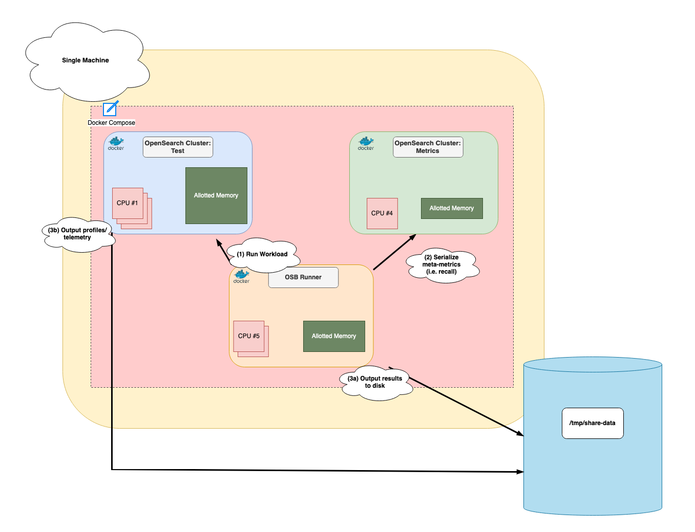

# OpenSearch Single Node KNN Experiments

## Overview

This repo contains a simple framework for running single node OpenSearch experiments for the k-NN plugin, using 
[Docker compose](https://docs.docker.com/compose/) and [OpenSearch Benchmarks](https://opensearch.org/docs/latest/benchmark/).

## Goals
The main goal of this project is to allow users to run highly-controlled performance tests on PoC code in 
an extremely efficient, yet configurable manner. Specifically, the goals are
1. Abstract away build of plugin and opensearch docker image - instead, provide a k-NN plugin endpoint and some versioning information, and the framework will take care of the rest
2. Provide extensive profiles - for PoC experiments, it is important to get insights into what is bottlenecking the system. However, it can be a hassle to setup JFR or async profiler. The framework will do this automatically
3. Provide extensive metrics - Fine-grained metrics should be available for experiments
4. Provide extensive telemetry - Give users extensive system metrics that can be used to understand behavior 
5. Provide out of the box OSB environment - setup OSB environment so user doesnt have to do any setup
6. Make OSB extendable - PoC features will typically not be available in OSB. So, it should be possible to extend OSB to support new experimental features

## Architecture



## Usage

### Entrypoint

The system is architected with a single [docker-compose file](compose.yaml). This docker compose will do the following:
1. Build a custom test OpenSearch docker image based on provided Github repo and test branch
2. Run a single node cluster with the custom docker image and resource constraints. It will add a JFR and system metrics and profiling
3. Run a lightweight separate OpenSearch metric cluster for OSB to output results to (this is kind of hacky and can be removed once we add recall to OSB test report)
4. Build a custom OSB image with the provided extensions
5. Run the configured OSB workload identified by the run ID and kick off an async profile on the OpenSearch process

All results will be sent to the file "/tmp/share-data". This folder is read/write from all containers. It is important 
that this is created up front before execution. All results will be identified based on the RUN_ID parameter provided as 
input. See [Parameters](#parameters) for what needs to be filled out in the env file.

```
# Run the test based on configuration in test.env file.
docker compose --env-file test.env -f compose.yaml up -d

# Stop the framework
docker compose --env-file test.env -f compose.yaml down
```

In more complex setups, you may want to write a script that starts/stops the containers. This can be done while 
preserving data ingested. See [experiments/low-mem-knn-exp/exp-1/run.sh](experiments/low-mem-knn-exp/exp-1/run.sh) as 
an example.

### Parameters
There are several environment variables that need to be configured in order to run the docker compose setup

| Key Name           | Description                                                                                                          |
|--------------------|----------------------------------------------------------------------------------------------------------------------|
| RUN_ID             | Run identifier. Will be used in file names                                                                           |
| TEST_REPO          | Link to k-NN repo. Plugin will be built from source from here. (i.e. https://github.com/opensearch-project/k-NN.git) |
| TEST_BRANCH        | k-NN branch name. Plugin will be built from source from here                                                         |
| TEST_JVM           | Amount of JVM to be used for test container (i.e. 32g)                                                               |
| TEST_CPU_COUNT     | Number of CPUs test container will get. (i.e. 2)                                                                     |
| TEST_MEM_SIZE      | Amount of total memory test container will be limited at. (i.e. 4G)                                                  |
| METRICS_JVM        | Amount of JVM to be used for metrics container (i.e. 1g)                                                             |
| METRICS_CPU_COUNT  | Number of CPUs metrics container will get. (i.e. 2)                                                                  |
| METRICS_MEM_SIZE   | Amount of total memory metrics container will be limited at. (i.e. 4G)                                               |
| OSB_PROCEDURE      | OSB procedure to be run                                                                                              |
| OSB_PARAMS         | OSB params to be used (include .json extension)                                                                      |
| OSB_SHOULD_PROFILE | Should profiling be triggered for this run (i.e. true or false)                                                      |
| OSB_CPU_COUNT      | Number of CPUs OSB gets (i.e 2)                                                                                      |
| OSB_MEM_SIZE       | Amount of memory OSB gets (i.e. 4g)                                                                                  |
| OPENSEARCH_VERSION | Version of OpenSearch to use (i.e. 3.0.0 or 2.15.0)                                                                  |

### Configuring OSB
OSB is the main benchmarking framework used for k-NN in OpenSearch.

From a high level, to run an experiment, we need to fill the [osb/custom/params](osb/custom/params) directory with the 
parameters we want to use for the run. This will tell OSB what to do. See 
[experiments](experiments/low-mem-knn-exp/exp-1/osb-params) for examples of different parameter configurations that can 
be selected. 

Also, if you want custom procedure or extensions, you need to add them directly to the source in the [osb](osb) 
directory.

For more general info about OSB and vector search, see https://github.com/opensearch-project/opensearch-benchmark-workloads/tree/main/vectorsearch.

## Results

### System Metrics

Several different system metrics are captured during runs. See 
[test-image/utils/process-stats-collector.sh](test-image/utils/process-stats-collector.sh) for more details. In general,
every second, the following metrics are collected from the OS process and output to the file 
"/tmp/share-data/telemetry/process-stats-${RUN_ID}.csv":
1. CPU_USAGE
2. MEM_USAGE
3. MINOR_FAULTS
4. MAJOR_FAULTS
5. ANON_RSS
6. ANON_FILE

Also, it is possible to capture full system metrics like io in wrapper scripts. See 
[experiments/low-mem-knn-exp/exp-4/io-poll.sh](experiments/low-mem-knn-exp/exp-4/io-poll.sh) for an example

### Profiles

From its entry-point, OSB will start an  async profile on the OpenSearch process that is delayed 120 seconds and runs 
for 60 seconds to capture a flamegraph of the process.

Additionally, the OpenSearch process is ran with JFR configured to give more profiling insights.

### Results

OSB will output its results to the "/tmp/share-data/results" path. In it, there will be a text file that contains the 
recall and one that contains the OSB report. 
